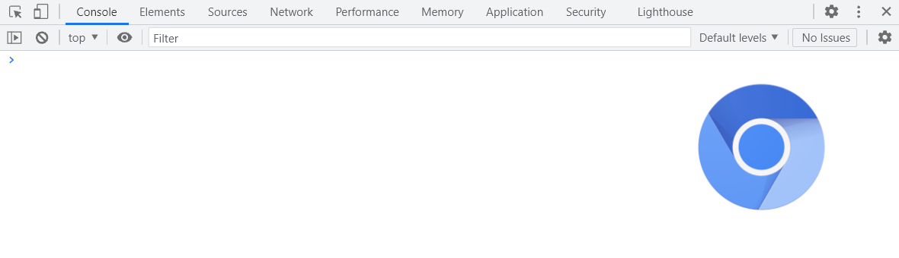
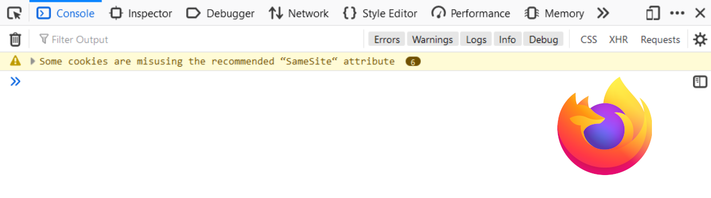
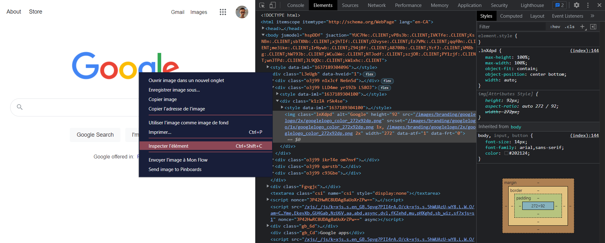

# Introduction aux Dev Tools navigateur

Ce guide est une introduction à l'usage **basique** des outils pour développeurs des navigateurs, communément appelés *Dev tools*, pour faciliter le **développement** et la **résolution de problèmes** en développement web. Le guide présente d'abord l'utilisation des outils et ensuite partage des cas d'utilisations/erreurs communs où l'application des *dev tools* devraient être un reflex. Sachez que ce guide, bien qu'il soit en français, montrera des exemples/images avec un paramétrage **en anglais**. La raison est que la plupart des références, guides et documentations sont plus nombreuses ou même précises en anglais, donc se familiariser avec l'interface et les termes en anglais est souvent plus concret.

## 1. Qu'est-ce que les *dev tools*?

Les *dev tools* sont des regroupements d'outils mis à disposition aux développeurs à même les navigateurs web pour **faciliter certaines tâches**, dont primairement la **collecte d'information** sur ce qui se passe dans votre navigateur ou **faire des manipulations mineures et temporaires**. Puisque les outils sont implémantés au sein même du navigateur, ils **peuvent différer entre chacuns**. Le "modèle" le plus répandu est celui des *dev tools* de [Google Chrome](https://developer.chrome.com/docs/devtools/). Puisqu'ils sont basés sur **Chromium**, le moteur derière Chrome, les mêmes outils sont retrouvés dans les autres navigateurs l'utilisant, soit [Opera](https://www.opera.com/)/[Opera GX](https://www.opera.com/gx), [Microsoft Edge](https://www.microsoft.com/en-us/edge) et une multitude d'autres, incluant même des modules n'étant pas des navigateurs comme [Electron Js](https://www.electronjs.org/). 

L'autre version la plus répandue sont les *dev tools* du navigateur [Firefox](https://developer.mozilla.org/en-US/docs/Tools). Les deux sont semblables, les différences les plus notoires étant que les fonctionalités, même si elles sont presque identiques, sont séparées dans des sous-menus différents.

Puisque les navigateurs sur Chromium sont plus populaires, **la suite de ce guide se suivra sur sa version des devtools**. Sachez que si vous utilisez Firefox, vous avez quand même accès à la plupart ou même la totalité des fonctionalités, donc ce n'est pas très grave!

## 2. Ouverture et onglets
Pour commencer, il faut savoir comment ouvrir les *dev tools*. Sur Chromium, la séquence de touches pour ouvrir **directement** les *dev tools* est **CTRL + Shift + i**. Ceci devrait normalement vous ouvrir la fenêtre avec l'onglet "Console" de préselectionné. Une autre option est de faire un clic droit et d'ensuite sélectioner l'option "Inspecter", qui vous ouvrira plutôt l'onglet "Éléments" avec la balise html située sous votre curseur au moment du clic de pré-sélectionnée. Faire **CTRL + Shift + c** fera la même chose, mais vous permet de sélectioner la balise de votre choix d'un clic gauche par la suite. Gardez en tête que les raccourcis claviers **fonctionnent même si le menu contextuel d'un clic droit est désactivé sur une page**.

Une fois ouverte, portez votre attention au **coin supérieur droit**. Vous y trouverez à la fois les **notifications** provenant de la console s'il y a lieu (plus de détails là-dessus plus tard), l'icone d'écrou représentant le menu des **paramètres** et finalement, à sa droite, les 3 points cachant les **options supplémentaires**. Pour faire bref, les paramètres offrent beaucoup d'options de préférences (comme le thème sombre dans mon cas) tandis que les options supplémentaires offrent de changer le point d'ancrage de la fenêtre, un menu "d'aide" et d'autres options plus spécialisées.

Ensuite, dans le **coin supérieur gauche**, vous avez en ordre **l'outil de sélection** qui fait la même chose que le raccourci **CTRL + Shift + c**, **l'outil d'appareil(s) mobile** qui simule l'affichage en appareil mobile (sans rapetisser la fenêtre!) et ensuite la multitude d'**onglets de fonctionalitées**. Voici une description de base de chacuns de ces derniers:

- ### *Console*

La console est votre couteau suisse du **débogage** en Javascript. Elle offre un affichage plus ou moins détaillé du comportement des scripts et de certains autres éléments associés à la page présente, comprenant les **erreurs**, **avertissements** ou n'importe quel **sortie** occasionée par vous au sein de vos scripts de par le biais de l'objet *console*. **AUSSITÔT** que vous avez un problème/comportement étrange, ouvrez instantanément la console pour de grosses chances d'avoir de précieux indices sur la cause du problème! Notez bien que la console permet aussi d'injecter directement du code, du loggage jusqu'à l'instanciation/affectation de variables, si besoin!

- ### Elements

